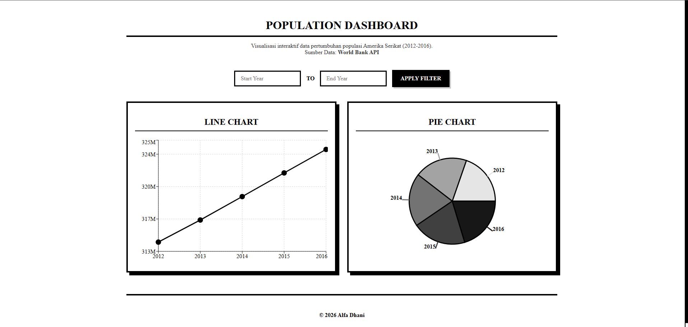

# Dashboard Populasi AS

Dashboard visualisasi data interaktif yang menampilkan pertumbuhan populasi Amerika Serikat dari tahun 2012 hingga 2016. Dibangun menggunakan React dan Recharts, menampilkan estetika desain neo-brutalis dan monokrom yang tegas.
<p align="center">
  
</p>

[Lihat Demo Langsung di Sini](https://task-no-limit.vercel.app/)

## Fitur Utama

- **Integrasi Data API:** Menarik data secara real-time menggunakan API resmi dari World Bank.
- **Visualisasi Dinamis (Line Chart):** Melacak tren populasi dengan sumbu grafik yang dihitung secara proporsional.
- **Visualisasi Dinamis (Pie Chart):** Menampilkan gradasi warna monokrom otomatis berdasarkan angka populasi (warna semakin gelap menunjukkan populasi yang lebih tinggi).
- **Filter Tanggal Interaktif:** Pengguna dapat memfilter data yang ditampilkan dengan memasukkan rentang tahun awal dan akhir.
- **Penanganan Data Kosong:** Tampilan informasi yang rapi dan responsif ketika rentang tahun yang dicari tidak tersedia di dalam data.
- **UI Neo-Brutalis:** Desain antarmuka monokrom yang tajam, garis tebal, kontras tinggi, lengkap dengan kustomisasi scrollbar.
- **Tata Letak Responsif:** Layout yang beradaptasi dengan mulus mulai dari layar HP hingga monitor desktop yang lebar.

## Tech Stack

- **Framework:** React.js
- **Library Grafik:** Recharts
- **API:** World Bank API
- **Styling:** CSS3 (Flexbox, Custom Scrollbars)

## Cara Menjalankan Project Lokal

Untuk menjalankan project ini di komputermu, ikuti langkah-langkah berikut:

1. **Clone repositori ini:**
   ```bash
   git clone [https://github.com/ALFADHANI284/Task_No-Limit.git](https://github.com/ALFADHANI284/Task_No-Limit.git)
   ```
2. **Masuk ke folder project:**
    ```bash
    cd nama-repo-kamu
    ```
3. **Install semua dependensi:**
    ```bash
    npm install
    ```
    
4. **Install semua dependensi:**
    ```bash
    npm start
    ```
#### © 2026 Alfa Dhani
